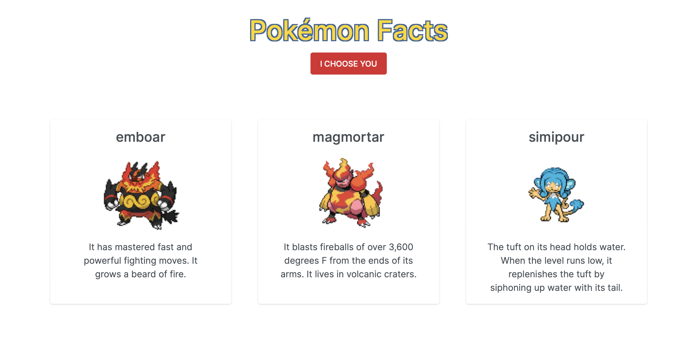

# **Pokémon Facts**

## **Overview**

The main feature of this application is to generate 3 random pokémon at a time to show name, image, and a fact about the pokémon.

## **API**

This application was created using data from the [<ins>**PokeAPI**</ins>](https://pokeapi.co). All data is sourced from the API's database.

## Technologies Used:

- [HTML](https://developer.mozilla.org/en-US/docs/Web/HTML)
- [CSS](https://developer.mozilla.org/en-US/docs/Web/CSS)
- [Axios](https://axios-http.com/docs/intro)
- [jQuery](https://api.jquery.com)
- [VSCode](https://code.visualstudio.com/docs)
- [Bootswatch](https://bootswatch.com/zephyr/)
